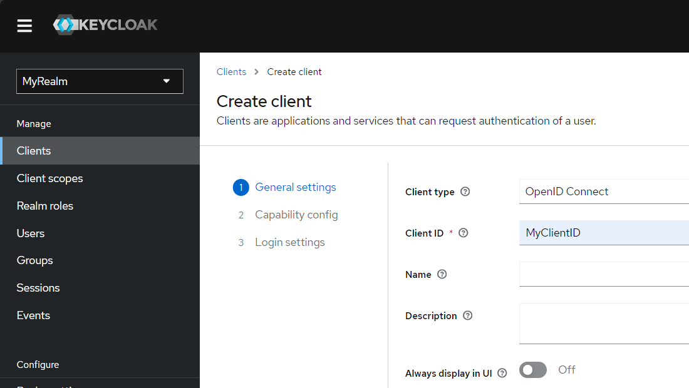
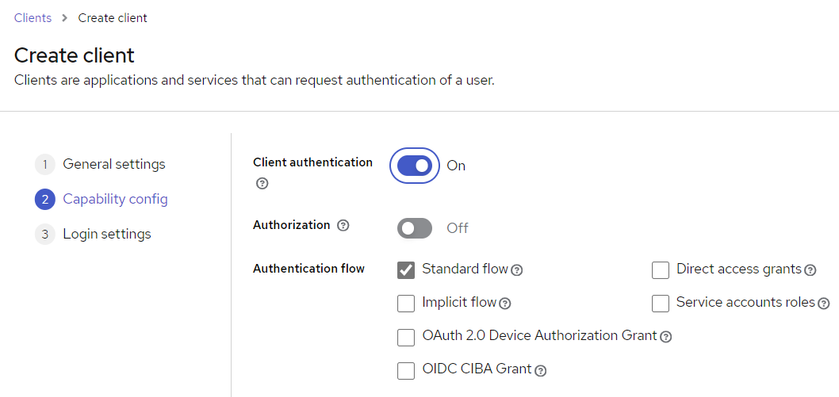
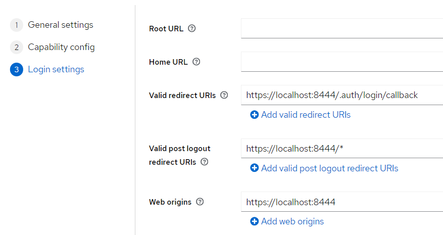
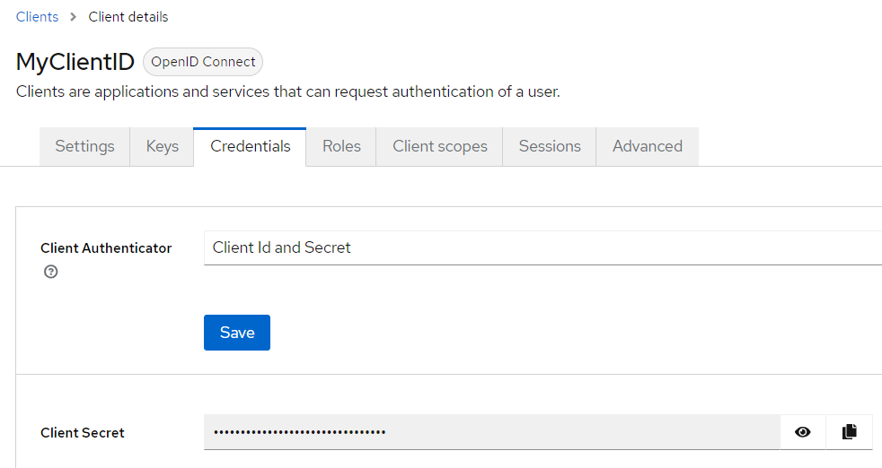

# Configuring Keycloak

OidcProxy.Net only supports the Authorization Code Flow with Proof Key for Client Exchange (PKCE). That’s why it is important to configure Keycloak in a specific way.

Follow these steps to configure Keycloak correctly:

- Sign in to the Administration Console of your Keycloak instance.
- (Optional) In the realms drop-down (top left), create a new realm to hold the users etc. for your app.
- Select your new realm and click "Clients", then click "Create client".
- Provide a Client ID describing your app, and click "Next".

- In the "Capability config" panel, turn on “Client authentication” and ensure only “Standard flow” is selected. Click Next.

- In the "Login settings" panel, enter the BFF URLs as shown, then click "Save".

Once the new client has been created, click on the Credentials tab. Ensure “Client Id and Secret” is selected as the Client Authenticator, and take a copy of the Client Secret. This and the Client ID will be needed for the spa+bff configuration.

Proceed with the instructions described in [readme.md](readme.md).
