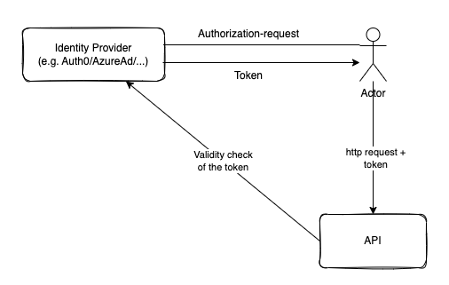
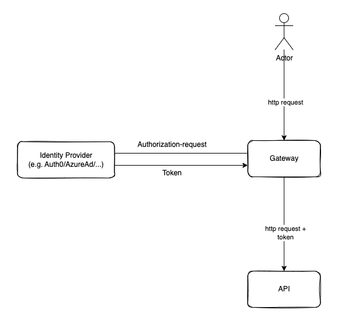

# What is Authorization Code with Proof Key for Code Exchange?

The Authorization Code flow with Proof Key for Code Exchange (PKCE) is an authentication method. It's part of OAuth2. It is used to authenticate end-users.

The OAuth2 protocol has patched a couple of times over time. Some authentication methods turned out to be less secure than expected.

Read about the history of OAuth2 and the purpose of the protocol to understand how PKCE came to be.

This article covers:
* The history of the OAuth2 protocol
* How it got pwned
* How it got patched

## The earlier versions of OAuth

OAuth was born in 2006/2007 at Twitter. They were trying to solve a problem. They had numerous servers on which they ran their site. Traffic was routed to these servers randomly. They needed some mechanism to make their APIs stateless and still know who is "logged-in". So they invented a protocol.

The OAuth2 protocol ([rfc6749](https://www.rfc-editor.org/rfc/rfc6749)), does two things:

* Authenticate humans (h2m)
* Authenticate machines (m2m)

The protocol has been designed for machine-to-machine (m2m) communication and human-to-machine (h2m) communication. To make this possible, the earlier OAuth versions had four "authentication methods" (grant types):

* [Client Credentials](https://www.rfc-editor.org/rfc/rfc6749#section-1.3.4) (m2m) \
Useful for a deamon service, for example. It posts the client_id + client_secret to the authorization server, and it responds with tokens. The tokens _do not_ represent a user.
* [Resource Owner](https://www.rfc-editor.org/rfc/rfc6749#section-1.3.3) (m2m) \
Useful for a deamon service, for example. It posts a username + password to the authorization server, and it responds with tokens. The tokens represent a user.
* [Implicit](https://www.rfc-editor.org/rfc/rfc6749#section-1.3.2) (h2m) \
The Single-Page-Application-flow. Used this flow to identify an end-users at the client-side.
* [Authorization Code]() (h2m) \
The server-side-website-flow. In the earlier versions of the protocol, this flow was explicitly used to identity an end-user on the server side.

Authentication manifests in three tokens:
* Access tokens \
This is an opaque string which contains the users authorizations.
* Refresh tokens \
This is an opaque string which can be used to get a new access token.

## How web authentication works

When a user wants to access a resource (e.g. invoke an API-endpoint), the user must authenticate first. In the earlier versions of OAuth, with Single-Page-Applications specifically, the end-user obtains an `access_token` at the client-side. This authentication method is called the `implicit` grant:



To get an access token, the user uses his browser to navigate to the authorization server via a special endpoint:

`https://{your_auth_server}/authorize?client_id={your_client_id}&response_type=token&redirect_uri=http://localhost/callback`

When the end-user navigates to this address, the end-user will see a log-in page. After a successful log-in, the user is redirect back to the to the site, to the `redirect_uri`. The authorization server will include the tokens in the redirect url as follows:

`http://localhost/callback#access_token=2YotnFZFEjr1zCsicMWpAA&state=xyz&token_type=example&expires_in=3600`

Note the `#` caracter in the URL. This is to make sure the token is not logged on the server side. The Single-Page-Application can read the payload after the `#`, and include the token in the requests to the APIs.

## Think twice if you want to use the Implicit flow
Over time, it turned out that this approach had some down-sides:

* The token will be in the browser history
* There is no way of telling _who_ is receiving the token

## PKCE at the client-side
Later in time, `PKCE` was introduced: [rfc7636](https://www.rfc-editor.org/rfc/rfc7636). Instead of using the `Implicit` flow, Single-Page Applications started using it to obtain tokens.

`PKCE` works as follows: 

Just like with the Implicit flow, the user navigates to the `/authorize` endpoint. But unlike Implicit, the Single-Page Application generates a password first and adds it to the authorize-request. Also, note that the response-type is no longer `token`. Instead, the Single-Page Application requests a `Code` which it will exchange for a `token` with the password it just generated:

`https://{your_auth_server}/authorize?client_id={your_client_id}redirect_uri=http://localhost/callback&response_type=code&code_challenge=elU6u5zyqQT2f92GRQUq6PautAeNDf4DQPayyR0ek_c&code_challenge_method=S256`

Just like with the implicit flow, when the user navigates to this url, the user will be presented a log-in page. After a succesful log-in, the authorization server redirects to the provided redirect url. Unlike the implicit flow, the url will not contain an access token. Instead, it contains a code which can be exchanged for an access token:

`http://localhost/callback#code=adgkjhedkjasdgfhsadjgalk`

Now, the Single-Page Application must post this code and the secret password (code_challenge) to the authorization server. If they check out, the authorization server will respond with the requested token:

```
POST https://{your_auth_server}/token

client_id={your_client_id}&
code_verifier=7073d688b6dcb02b9a2332e0792be265b9168fda7a6&
redirect_uri=http%3A%2F%2Flocalhost%2Fcallback&
grant_type=authorization_code&
code=adgkjhedkjasdgfhsadjgalk
```

This mechanism has the following advantages:
* The code can be exchanged for a token only once
* Only whoever has the secret password will get the token

So, as a result, it is much safer to say that only the Single-Page Application has gotten the `access_token`. And if somebody manages to get both the code and the password, there's a very short window these can be abused.

## Still not safe enough
But still, PKCE at the client-side is considered not to be safe enough. 

* You still can not be sure the `access_token` ended up on the intended computer. It might still be possible to 'steal' the code and the code_verifier.
* Since the `access_token` is stored at the client-side (usually in localstorage or sessionstorage), there are ways to 'steal' the access_token.

So, generally speaking, currently, the statement in the community is:

___Do not store access_tokens at the client-side.___

## PKCE on the server side
The problem with PKCE at the client-side is that the `client_secret` is not used. Obviously, the `client_secret` may never be used at the client-side. With the `client_secret` one can ensure the token is given to a trusted party. 

Therefor, the only way to ensure the token ends up at the intended machine is to move the process of obtaining a token to a trusted machine: your server. As a result, you are going to need some authentication gateway:



## Summary
For more secure applications, do not use the Implicit flow nor the PKCE flow at the client-side. Instead use the PKCE-flow with client_secret at the server side.
